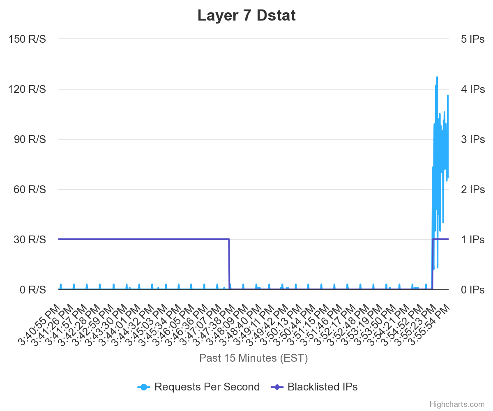

<h1 align="center">Overflood Request</h1>

<p align="center">
    
</p>

Is not an auto visitor website, but provides over requests at one time. use `VPS` or something else, dont use termux or anything like that, cellular data/wifi itself cuz can `kill your network.` 

This is only for educational purposes, im not responsible for anything outside of that.

#### Requirements

```javascript
npm install figlet path fs readline cloudscraper
```

#### Installation

```javascript
npm install overflood && mv node_modules/overflood ./ && cd overflood
```

#### Execution

- with proxy 
```javascript
node withproxy.js
```

- or non proxy
```javascript
node nonproxy.js
```

### License

This project is licensed under the [AGPL-3.0 License](https://github.com/naix0x/overflood/blob/main/LICENSE).


